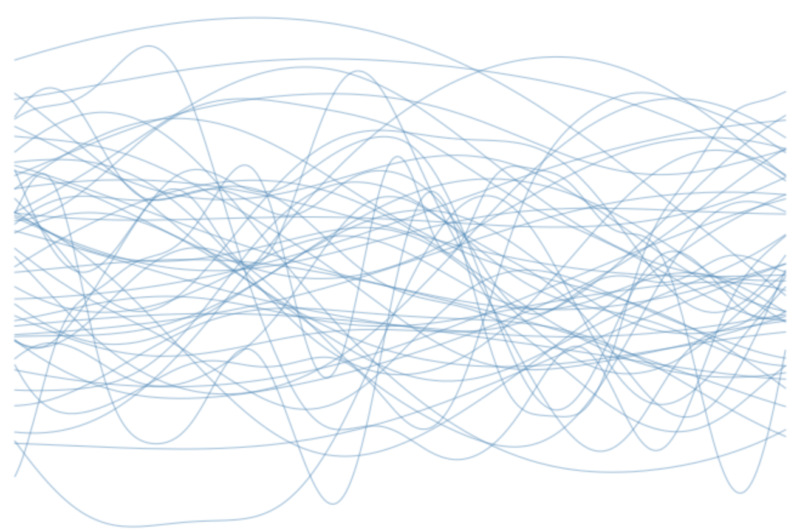

#######################################
Gaussian Process Background
#######################################

.. _gp-implementation:

----------------
Introduction
----------------

This document focuses on the implementation details of some of the
approaches used in
`albatross <https://github.com/swift-nav/albatross>`__.

If you're new to Gaussian processes you might consider watching these videos:

`Machine Learning Lecture 26 "Gaussian Processes" Cornell CS4780 SP17 <https://www.youtube.com/watch?v=NegVuuHwa8Q>`__ (Kilian Weinberger)

`Gaussian Process Basics <https://www.youtube.com/watch?v=NegVuuHwa8Q>`__ (David Mackay)

And you might consider working through the `tutorials <https://github.com/swift-nav/albatross/tree/master/tutorials>`__ we've put together. These tutorials are in python notebooks (not c++) and are meant to serve as an educational tool to build intuition and introduce some of the tips and tricks you encounter when using GPs.

For a deep dive in Gaussian processes, read the book `Gaussian Processes for Machine Learning <https://gaussianprocess.org/gpml/chapters/>`__.

There are also a number of excellent introductions to Gaussian processes (see our :ref:`references`) here we assume some understanding of GPs and focus on describing the details of the implementations we use in `albatross`.

----------------
Notation
----------------

For the most part the notation below tries to stay as close as possible to the notation used in `Gaussian Processes for Machine Learning`_, but there are a few departures.

In general a bold font variable such as :math:`\mathbf{y}` indicates a random variable and the non bold font equivalent, :math:`y`, indicates a realization of that variable. Note that this differs from the popular
notation of using bold font for vectors, for most of what follows we
assume that whether something is a scalar or a vector needs to be
inferred from context. As an example, if
:math:`\mathbf{y} \sim \mathcal{N}(0, 1)` then one measurement,
:math:`y`, from the distribution :math:`\mathbf{y}` might be
:math:`0.83`. To be explcit that a sample came from a distribution we’d
write :math:`y \leftarrow \mathbf{y}`.

Conditional distributions are written with the :math:`|` symbol so, for
example, the random variable :math:`\mathbf{z}` given knowledge that
:math:`\mathbf{y}` is :math:`y` would be written, :math:`\mathbf{z}|\mathbf{y}=y`.
Often this is shortened to :math:`\mathbf{z} | y`. If we really want to be clear about something being a random
variable we’ll write :math:`\mbox{p}(  \mathbf{z}|y)`.

---------------------------
Gaussian Process Regression
---------------------------

Gaussian processes can be used for many different prediction problems
but here we focus on regression, which refers to a situation where you
have some noisy observations of a function and you’d like to infer the
function value at un-observed locations.

More specifically, say you have some training data,
:math:`\mathcal{D} = \left\{(x_i, y_i); i \in [0, \ldots, n]\right\}`
which consists of measurements :math:`y_i` of the unknown function,
:math:`f`, evaluated at :math:`x_i`, which is contaminated by noise,
:math:`\mathbf{\epsilon}_i \sim \mathcal{N}\left(0, \sigma_i^2\right)`,

.. math:: y_i \leftarrow f(x_i) + \mathbf{\epsilon}_i

Gaussian process regression is used to infer the unknown function
given the noisy measurements. The result is a function,
:math:`f_{GP}\left(x^*\right)` which provides us an estimate of the
unknown function. The use of :math:`*` indicates out of sample locations,
meaning locations which were not neccesarily used to train the Gaussian process.
Predictions from a Gaussian process provide more than just the expected
value of the unknown function, it provides an estimate of the full distribution of
possible function values,

.. math:: f_{GP}\left(x^*\right) \rightarrow \mbox{p}\left(f(x^*)|\mathcal{D}\right).

---------------------------
Covariance Functions
---------------------------

We describe a Gaussian process as,

.. math:: f_{GP}\left(x\right) \sim \mathcal{GP}\left(m(x), c(x, x')\right).

Here :math:`m(x)` is the mean function which computes the prior estimate
of the function at arbitrary locations and :math:`c(x, x')` is the
covariance function (aka kernel) which defines the covariance between
two measurements at locations :math:`x` and :math:`x'`. Note that
usually the mean is set to zero since these effects can be removed
before modelling or can be folded into the covariance function.

Gaussian process model development is usually focused on defining the
covariance function. The covariance function describes our prior
expectations about what the unknown function might look like. Covariance
functions can be designed to capture a wide variety of phenomena. We may,
for example, be interested in estimating a temporal process that we think
is smooth in time. In which case we could use a radial basis function such as the squared
exponential,

.. math:: c(x, x') = \sigma^2 \mbox{exp}(-\frac{|x - x'|_2^2}{\ell^2}).

   Samples from a Gaussian process prior using a squared exponential
   covariance function with various length scales.

Covariance functions can capture constant offsets, :math:`c(x, x') = a`,
linear trends, :math:`c(x, x') = x * x'`, as well as countless other
interactions. Covariance functions can be composed using sums, products
and convolutions allowing you to define simple functions describing a
single phenomena, then combine them with other functions to produce a
more powerful model. Some of the more complex parts of the albatross
code base are generic tools for composing and evaluating covariance
functions. Choosing the covariance function (and associated hyper
parameters) can be the hardest part and is very application specific and
not in the scope of this document, so for what follows we will assume a
valid covariance function has been provided.

---------------------------
Building a Gaussian Process
---------------------------

Given a covariance function, :math:`c(x, x')` we can build our prior at
the observed locations, :math:`x = \left[x_0, \cdots, x_n\right]`, by
evaluating the function for each pair of locations,

.. math::

   \mbox{Cov}[
     \mathbf{y}
   ] = \Sigma_{yy} =
   \begin{bmatrix}c(x_0, x_0) & c(x_0, x_1) & \cdots & c(x_0, x_n) \\
                                          c(x_1, x_0) & c(x_1, x_1) & & \vdots \\
                                          \vdots & & \ddots & \vdots\\
                             c(x_n, x_0) & \cdots & \cdots & c(x_n, x_n) \end{bmatrix}

Doing a similar operation with the mean function, :math:`m(x)`, gives us
the prior distribution for our measurements,

.. math::

   \begin{bmatrix} \mathbf{y}_0 \\ \vdots \\ \mathbf{y}_n \end{bmatrix}
    \sim \mathcal{N}\left(\begin{bmatrix} m(x_0) \\ \vdots \\ m(x_n) \end{bmatrix},
   \begin{bmatrix} c(x_0, x_0) & \cdots & c(x_0, x_n) \\
   \vdots & & \vdots \\
   c(x_n, x_0) & \cdots & c(x_n, x_n) \\
   \end{bmatrix} \right)

or more concisely,

.. math:: \mathbf{y} \sim \mathcal{N}\left(\mu_y, K_{yy}\right)

At its core that’s all there is to a Gaussian process. It’s just a way
of describing how to create multivariate Gaussian distributions for
arbitrary data, the process of fitting and predicting are just
:ref:`manipulations of Multivariate Gaussian Distributions<mvn>`.

------------------
Making Predictions
------------------

We now have all the tools we need to fit and predict with a Gaussian
process. We can use the covariance function to build a multivariate
Gaussian distribution which includes both our prior for our measurements
:math:`\mathbf{y}` and the unknown function values , :math:`\mathbf{f}
^* = \mbox{p}[f(x^*)]`,

.. math::

   \left[\begin{array}{c} 
     \mathbf{y}
    \\ 
     \mathbf{f}
   ^* \end{array}\right] \sim \mathcal{N}\left(0, \left[
   \begin{array}{cc} K_{yy} & K_{y*} \\ K_{*y} & K_{**} \end{array}\right]\right)

Making a prediction then consists of forming the `conditional
distribution <https://en.wikipedia.org/wiki/Multivariate_normal_distribution#Conditional_distributions>`_ of :math:`\mathbf{f}
^*` given our measurements :math:`y \leftarrow \mathbf{y}`,

.. math::
   :name: eq:posterior

     \mathbf{f}
   ^*|y \sim \mathcal{N}\left( K_{*y} K_{yy}^{-1} y \hspace{0.1cm}, \hspace{0.1cm} K_{**} - K_{*y} K_{yy}^{-1} K_{y*} \right)

That’s it. You provide a covariance function, measurements :math:`y` at
locations :math:`x` and computing the conditional distribution will
produce predictive distributions :math:`\mathbf{f^*}` for arbitrary new
locations, :math:`x^*`.

----------------------
Fitting a Model
----------------------

A naive approach to fitting (or training) would be to simply store
:math:`c(x, x')`, :math:`y` and :math:`x` then for each desired
prediction :ref:`compute the posterior distribution <eq:posterior>`. While such
an approach would be extremely memory efficient (two vectors :math:`x`
and :math:`y` so :math:`\mathcal{O}(2n)` storage) it would result in
repeated computation of :math:`K_{yy}^{-1}` which requires
:math:`\mathcal{O}(n^2)` evaluations of the covariance function and
:math:`\mathcal{O}(n^3)` floating point operations for the inverse.

Instead we can decompose :math:`K_{yy}` which will accelerate
subsequent predictions. One such way to front load computation involves
computing the Cholesky decomposition of :math:`K_{yy}`,

.. math:: L L^T = K_{yy}

and the information vector,

.. math:: v = K_{yy}^{-1} y.

After which a prediction can be made using,

.. math::

   \label{eq:cholesky_prediction}

     \mathbf{f^*}
   |y \sim \mathcal{N}\left( K_{*y} v \hspace{0.1cm}, \hspace{0.1cm} K_{**} - A^T A \right)

with

.. math:: A = L^{-1} K_{y*}

Such an approach will require storing :math:`L`, and :math:`v` resulting
in :math:`\mathcal{O}(n^2)` storage, but reduces the computation cost
when predicting.

The Cholesky decomposition isn’t particularly stable unless you do
pivoting. As a result the albatross implementation uses the LDLT
decomposition,

.. math:: P^T L D L^T P = K_{yy}

where :math:`P` is a permutation matrix that holds the ordering used
after pivoting and :math:`D` is a diagonal matrix. This leads to a
slightly different :math:`A`,

.. math:: A = D^{-1/2} L^{-1} P K_{y*}

but otherwise all the math is the same. This LDLT approach is what
we use in albatross when you build a Gaussian process in `albatross` and fit the model,

.. code-block:: c

    auto model = gp_from_covariance(k);
    RegressionDataset<> dataset(x, y);
    auto fit_model = model.fit(dataset);

-----------------------
Predictive Distribution
-----------------------

Once we've fit a model we can use it to make a prediction at arbitrary locations (called features in `albatross`), :math:`\mathbf{x}^*`,

.. math::

    \mathbf{f^*}|y \sim \mathcal{N}\left(K_{*f} K_{ff}^{-1} y, K_{**} - K_{*f} K_{ff}^{-1} K_{f*}\right)

Instead of computing this all from scratch, we use the precomputed quantities from the fit step.  In particular we would write this,

.. math::

    \mathbf{f^*}|y & \sim \mathcal{N}\left(K_{*f} v, K_{**} - K_{*f} (P^TLDL^TP)^{-1} K_{f*}\right) \\
    & \sim \mathcal{N}\left(K_{*f} \mathbf{v}, K_{**} - (K_{*f} P^T L^{-T} D^{-1/2}) (D^{-1/2}L^{-1}P K_{f*}\right) \\
    & \sim \mathcal{N}\left(K_{*f} \mathbf{v}, K_{**} - Q_{f*}^T Q_{f*}\right)

Where :math:`Q_{f*} = D^{-1/2}L^{-1}P K_{*f}^T`.

To make a prediction in albatross you'd first fit the model (see above), then call,

.. code-block:: c

    const auto prediction = fit_model.predict(new_features);

This ``predict`` call is actually a lazy operation (nothing is actually computed yet). You then have some choices for the actual prediction type you'd like:

^^^^^^^^^^^^^^^^^^^
Mean Predictions
^^^^^^^^^^^^^^^^^^^

Calling:

.. code-block:: c

    const Eigen::VectorXd mean = prediction.mean();

would:

* Evaluate :math:`K_{*f}`
* Compute the mean :math:`K_{*f} v`

^^^^^^^^^^^^^^^^^^^^
Marginal Predictions
^^^^^^^^^^^^^^^^^^^^

Calling:

.. code-block:: c

    const MarginalDistribution marginal = prediction.marginal();

would:

* Compute :math:`Q_{f*} = D^{-1/2}L^{-1}P K_{*f}^T`  
* Evaluate the prior variance :math:`\mbox{diag}(K_{**})`
* Compute the posterior variance :math:`\mbox{diag}(K_{**}) - \mbox{diag}(Q_{f*}^T Q_{f*})`

^^^^^^^^^^^^^^^^^^^
Joint Predictions
^^^^^^^^^^^^^^^^^^^

Calling:

.. code-block:: c

    const JointDistribution marginal = prediction.joint();

would:

* Evaluate the prior covariance :math:`K_{**}`
* Compute the posterior covariance :math:`K_{**} - Q_{f*}^T Q_{f*}`

.. _`Gaussian Processes for Machine Learning`: http://gaussianprocess.org/gpml/chapters/RW.pdf
